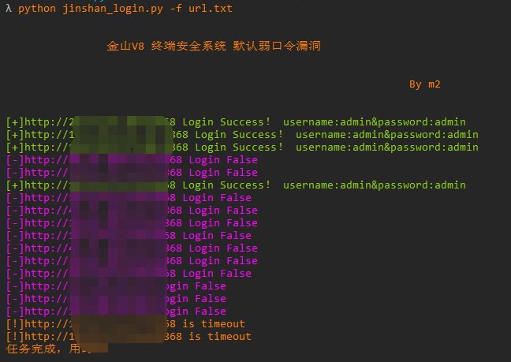

# jinshanv8_login_fuzz
金山 V8 终端安全系统后台弱口令批量爆破。

## 工具利用

python3 jinshan_login.py -u http://127.0.0.1:1111 单个url测试

python3 jinshan_login.py -f url.txt 批量检测

如果想新增密码，请在脚本中password列表中添加

## 免责声明

由于传播、利用此文所提供的信息而造成的任何直接或者间接的后果及损失，均由使用者本人负责，作者不为此承担任何责任。
